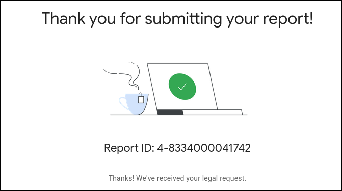

# Evidence of Unauthorized Publishing

This document records the actions taken against me after my departure from NineSMP.

> [!IMPORTANT]
> This page documents factual evidence. All links and report IDs are real and verifiable.

---

## What Happened After I Left

After I left NineSMP, instead of a professional separation, my private work was **publicly distributed** without my consent on Planet Minecraft.

This includes:

- **My custom Anti-DDoS + Velocity infrastructure setup** — built by me for NineSMP
- **My custom Discord ticket & store bot** — written by me for NineSMP

These were uploaded publicly, without my knowledge or permission, under the NineSMP name.

---

## Published Without My Permission

### 1. Anti-DDoS + Velocity Setup

> **Platform:** Planet Minecraft — Forums  
> **URL:** https://www.planetminecraft.com/forums/minecraft/servers/java-anti-ddos-protection-velocity-setup-download-link-in-discription-708740/  
> **Status:** Taken down (page now returns 403 Forbidden)

This was my infrastructure work — a custom Velocity-based DDoS mitigation setup I built for the server. It was uploaded publicly as a free download without my permission.

---

### 2. NineSMP Discord Bot (Ticket & Store Bot)

> **Platform:** Planet Minecraft — Data Packs  
> **URL:** https://www.planetminecraft.com/data-pack/free-nine-smp-discord-ticket-amp-store-bot/  
> **Status:** Taken down (page now returns 403 Forbidden)

This was a custom Discord bot I wrote for NineSMP to handle support tickets and store functionality. It was published as a "free data pack" without my consent.

---

### 3. Google Drive Distribution

> **Platform:** Google Drive (public link)  
> **URL:** https://drive.google.com/file/d/1dNPbuiyuW0Vq0EPQlw6HczqZr1PoRWkr/view?pli=1  
> **Status:** Reported to Google

My work was also distributed via a public Google Drive link.

---

## Legal Report Filed

After discovering that my work was being distributed without my consent, I submitted a **legal report to Google**.

> **Platform:** Google  
> **Report ID:** `4-8334000041742`  
> **Status:** Acknowledged — Google confirmed receipt of the legal request

---

## What This Means

1. The work published was **mine** — built by me, for NineSMP, during my time as a 50/50 partner.
2. **No permission was given** to redistribute or publish this work after my departure.
3. Publishing another person's software without consent is a violation of intellectual property rights.
4. Both Planet Minecraft pages were taken down — confirming the content was removed after being reported.
5. A legal report has been filed with Google regarding the Drive distribution.

---

## Summary

| Item | Platform | My Work | Permission Given | Status |
|------|----------|---------|-----------------|--------|
| Anti-DDoS + Velocity Setup | Planet Minecraft | ✅ Yes | ❌ No | Taken Down |
| Discord Ticket & Store Bot | Planet Minecraft | ✅ Yes | ❌ No | Taken Down |
| Discord Bot | Google Drive | ✅ Yes | ❌ No | Reported to Google |

---

> This evidence is provided to document what occurred after my departure.  
> My intention is not to encourage harassment of anyone.  
> This is a factual record for anyone who wants to understand the full picture.

---

**Neon (NeonJava)**
